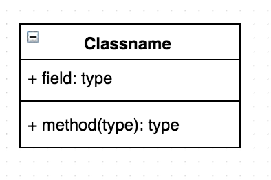
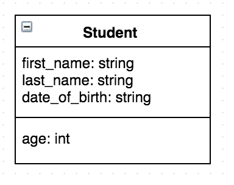
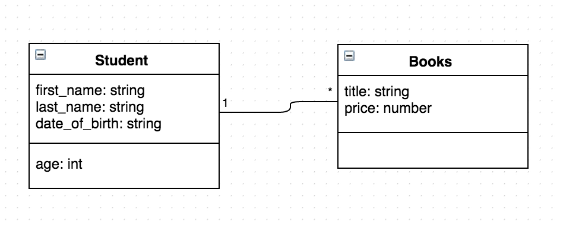

# Entity Relationship Diagrams

- Translate user stories into Class Diagrams by extracting nouns from user stories
- Propose more than one Class Diagram for a given set of nouns (deciding between Classes and Attributes)

Being a fullstack developer requires you to be able to turn words into software.  Often times the words you get are in the form of user stories, and there's a big chasm between user stories and lines of code.  When turning words into software, you are "modeling" the domain, it's often useful to draw the entities, attributes and relationships visually.

## Objectives

By the end of this lesson you should be able to:

- Draw a UML Class Diagram well enough (doesn't have to be academically perfect)
- Define Class, Attribute and Method in the context of a Class Diagram

## It's a... well... a clusterfuck

People have developed several ways of drawing models for code.  In this lesson you'll be exposed to Class Diagrams (a part of [UML](https://en.wikipedia.org/wiki/Unified_Modeling_Language)).

Learning the fine details of the UML spec is unnecessary, because you are unlikely to find any fullstack developers in the industry that know the spec in a very detailed way.  And that's OK, because even with a basic sense of how to draw and read them, you can solve most of your team's communication problems.

## Class Diagrams

The core of an Class Diagram is a Class, which looks like this:



Classes are blueprints for instances.  Instances have both state (attributes, aka properties), and behavior (methods aka functions).  Class diagrams describe exactly which attributes and methods an instance of that class will have.

For example, imagine you are modeling a Student.  The class diagram for that student might look like this:



In ES5 JavaScript, if you were to implement this class, it might look something like:

```js
var Student = function (firstName, lastName, dateOfBirth) {
  this.firstName = firstName
  this.lastName = lastName
  this.dateOfBirth = dateOfBirth
}

Student.prototype.age = function () {
  // calculate age here...
}

var joe = new Student('Joe', 'Jo', '12/12/1983')
var sue = new Student('Sue', 'Su', '11/11/1987')
```

Look back at the diagram.  Notice the 3 main parts.

- The **class name** (Student) is at the top
- The **attributes** (`first_name`, `last_name`, `date_of_birth`) are in the middle
- The **methods** (`age`) are at the bottom

> Astute Student:  **BUT WAIT!**  The Class Diagram shows snake case (`first_name`) and the JavaScript code has camelCase (`firstName`).  Shouldn't some UML stickler be turning over in their grave?

> Seasoned Developer: The short answer is that these diagrams represent the _concept_ of a Student.  They don't have to match any particular languages capitalization norms.  But some people _really_ care about it, so be nice to them when you encounter them in the wild.  They probably don't have a lot of friends.  Standing at the whiteboard in the industry, it doesn't matter much.

There's one final part of these diagrams - **relationships**.  Relationships are defined by drawing lines between Classes, like so:



If you were to implement this in JavaScript, it might look like this:

```js
var Student = function (firstName, lastName, dateOfBirth) {
  this.firstName = firstName
  this.lastName = lastName
  this.dateOfBirth = dateOfBirth
  this.books = []
}

Student.prototype.age = function () {
  // calculate age here...
}

var Book = function (title, price) {
  this.title = title
  this.price = price
}

var joe = new Student('Joe', 'Jo', '12/12/1973')
joe.books.push(new Book('Cracking the Coding Interview', 12.99))
```

> Astute Student:  **BUT WAIT!**  The student class has a `books` attribute, but it's not on the diagram!  

> Seasoned Developer: Yeah, yeah - I know.  You have two choices when you model relationships - you can include the attribute (in this case `books`) or leave it out.  If you leave it out, you must _assume_ that the code will have that attribute with the correct pluralization.  There's probably an academic answer to what's "correct" in the UML spec, but in the industry, few people care.

**Read up on relationships**

First, visit [http://www.smartdraw.com/class-diagram/](http://www.smartdraw.com/class-diagram/) and specifically read the "Multiplicity (Cardinality)" section to see one explanation of how to draw relationships.

Then go to  [http://www.agilemodeling.com/artifacts/classDiagram.htm](http://www.agilemodeling.com/artifacts/classDiagram.htm) and read "Table 1. Multiplicity Indicators."

## Exercise

OK - you are ready for some code.  Visit [https://www.draw.io/](https://www.draw.io/) and start a new diagram.

**Words to Diagram**

Draw a Class named "Device" with the attributes "width", "height", "depth" and the methods "volume" and "powerOn".

Draw a Class named "Geek" with the attributes "handle" and

- https://www.youtube.com/watch?v=-fQ-bRllhXc (be sure to watch at 1.5x)
-
- http://searchcrm.techtarget.com/definition/entity-relationship-diagram
- http://www.smartdraw.com/entity-relationship-diagram/
- http://www.smartdraw.com/uml-diagram/


## Exercise


You're helping build the next big real estate application. You and your team are all set to disrupt the market if you can successfully model your domain and release your software.

You are handed several user stories. Before you get started, you decide to sit down and model out the domain to support such crazy requirements.

As you go through each story, build up the model that you think will satisfy the story. Each addition must not "break" previous requirements. Given the pace of the start-up world, you only have 20 minutes to accomplish your task.
Stories

* As a Real Estate Agent, when I register then I can log in.
* As a Real Estate Agent, I can add a house listing.
* As a Real Estate Agent, I can view all of my listings.
* As a Potential Buyer, I can select a primary Real Estate Agent, which I can only have one of.
* As a Real Estate Agent, I can create an office with an address.
* As a Real Estate Agent, I can add other Real Estate Agents to my office.
* As a Real Estate Agent, I can belong to more than one office.
* As a Potential Buyer, I can view house listings.
* As a Potential Buyer, I can mark that I'm interested in a listing.
* As a Potential Buyer, I can view all listings I'm interested in.

Now read up on cardinality at [https://en.wikipedia.org/wiki/Entity%E2%80%93relationship_model](https://en.wikipedia.org/wiki/Entity%E2%80%93relationship_model) and in particular, focus on the Crow's Foot notation.  This is one of the more common notations used when writing things quickly on a whiteboard.
